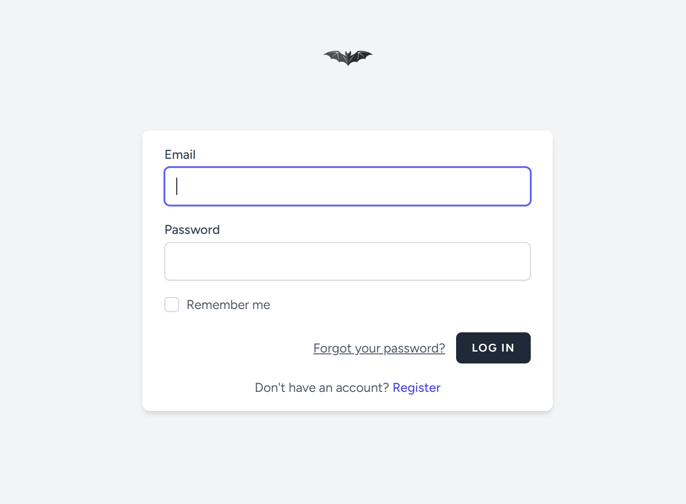
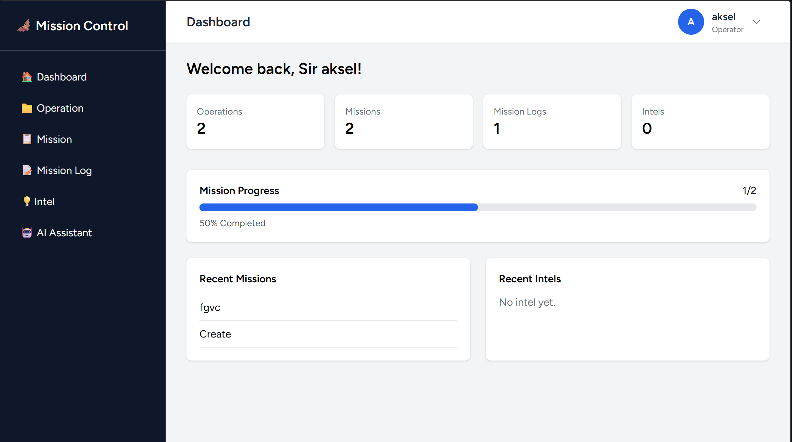
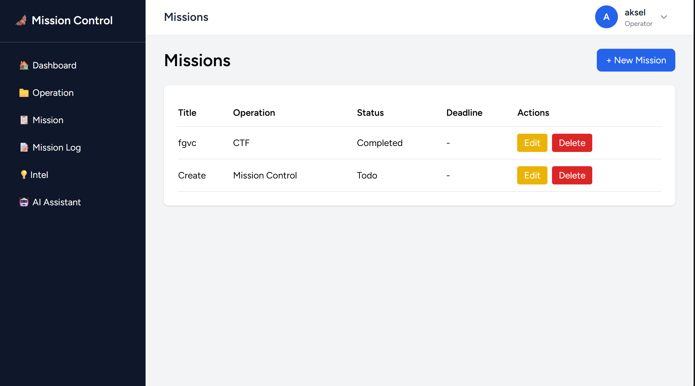
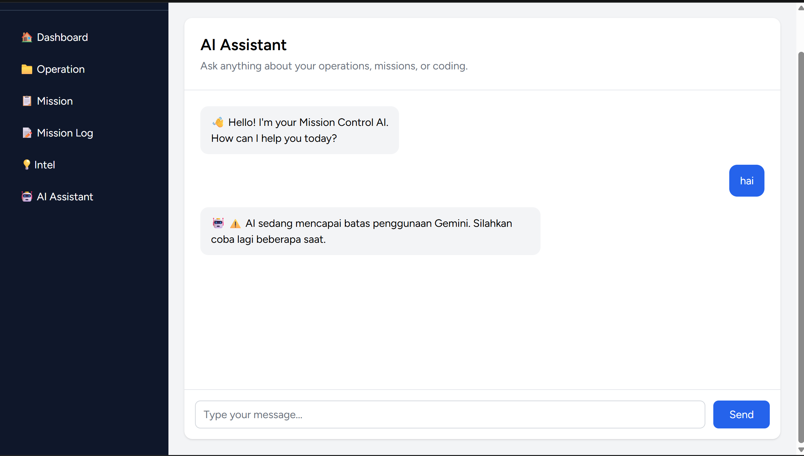

# Mission Control

Mission Control adalah aplikasi web berbasis Laravel yang dikembangkan sebagai proyek UAS mata kuliah **Pemrograman Web 2**. Aplikasi ini membantu pengguna mengelola project, task, dokumentasi perkembangan, serta catatan pengetahuan dalam satu dashboard yang terintegrasi.

## Features

- Authentication (Login & Register)
- Dashboard
- Operation Management (CRUD)
- Mission Management (CRUD)
- Mission Log Management (CRUD)
- Intel Management (CRUD)
- AI Assistant (Google Gemini API)
- User Profile Management

## Tech Stack

- Laravel 12
- PHP
- MySQL
- Blade
- Tailwind CSS
- Google Gemini API

## Installation

Clone repository

```bash
git clone https://github.com/reakkszz/Mission_Control.git
```

Masuk ke folder project

```bash
cd Mission_Control
```

Install dependency

```bash
composer install
npm install
```

Copy file environment

```bash
cp .env.example .env
```

Generate application key

```bash
php artisan key:generate
```

Atur konfigurasi database pada file `.env`, kemudian jalankan

```bash
php artisan migrate
```

Jalankan aplikasi

```bash
php artisan serve
npm run dev
```

## Database Structure

- Users
- Operations
- Missions
- Mission Logs
- Intels

## Screenshots

### Login



### Dashboard



### Mission




### AI Assistant



## Author

**Aksel**

GitHub: https://github.com/reakkszz
